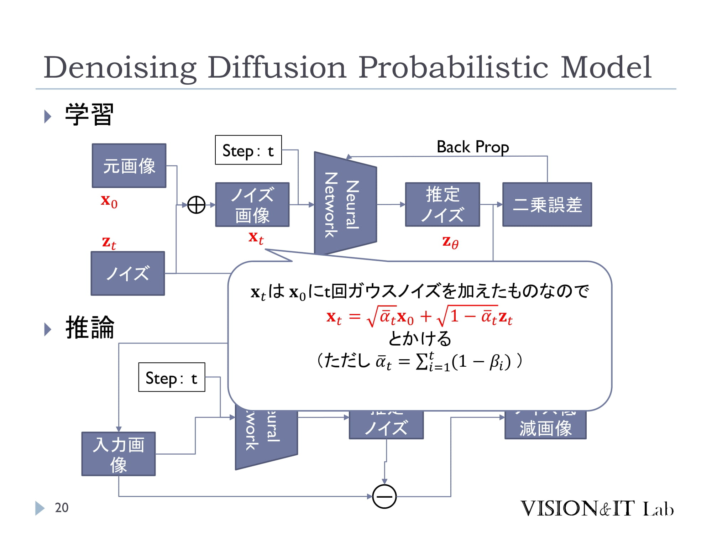
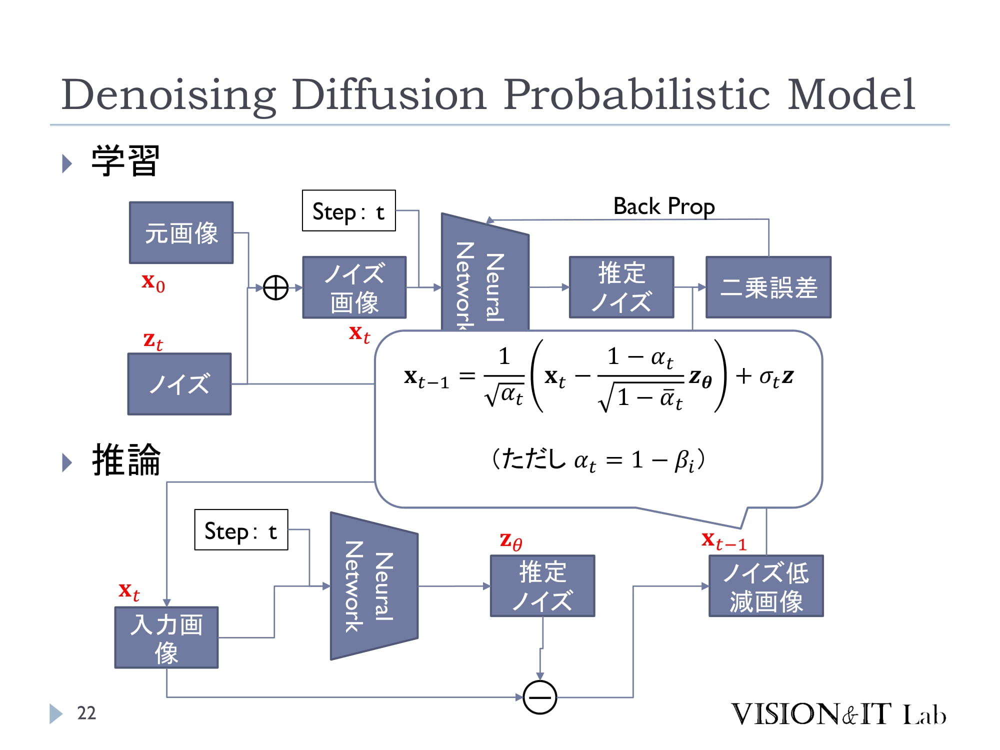

## 概要
- 画像に逐次的にノイズを付加しランダムな画像を生成するプロセスを考える
- 上記の逆過程を推定することで、ランダムな画像から何らかのそれっぽい画像を生成する

DALL-E や Imagen などの画像生成は拡散モデルがベース
### （脳のモデル？）



岡野原さんの著書はいずれちゃんと読む。

## 読んだやつ
1. Ho, J., Jain, A., & Abbeel, P.. (2020). [Denoising Diffusion Probabilistic Models](https://arxiv.org/abs/2006.11239).
2. Weng, L. (2021). [What are Diffusion Models?](https://lilianweng.github.io/posts/2021-07-11-diffusion-models/). lilianweng.github.io.
3. 第 10 回全日本コンピュータビジョン勉強会「生成モデル論文縛り読み会」[A Conditional Point Diffusion-Refinement Paradigm for 3D Point Cloud Completion](https://speakerdeck.com/takmin/a-conditional-point-diffusion-refinement-paradigm-for-3d-point-cloud-completion)
4. [最近話題の"Diffusion Model（拡散モデル）"について、簡潔にまとめてみた](https://nakajimeee.hatenablog.com/entry/2022/01/03/041646)
5. Shitong Luo, & Wei Hu (2021). [Score-Based Point Cloud Denoising](https://arxiv.org/abs/2107.10981). In 2021 IEEE/CVF International Conference on Computer Vision (ICCV). IEEE.
6. [Awesome-Diffusion-Models](https://github.com/heejkoo/Awesome-Diffusion-Models)（拡散モデルの応用研究をまとめたレポジトリ）
7. Luo, C.. (2022). [Understanding Diffusion Models: A Unified Perspective](https://arxiv.org/abs/2208.11970).
8. 須山敦志 (2019)『ベイズ深層学習』講談社

## 準備
### 表記
- ステップ $t$ における確率変数：$\mathbf{x}_t\in\mathbb{R}^D$
  - $t=0,1,\ldots ,T$
  - たとえば画像なら $D=\text{Height}\times\text{Width}\times\text{RGB}$ など
- $\mathbf{x}_{0:T}:=\mathbf{x}_0,\mathbf{x}_1,\ldots,\mathbf{x}_T$

変数 $\mathbf{x},\mathbf{y}$ の同時分布 (joint distribution) $p(\mathbf{x},\mathbf{y})$ に対する以下の操作を周辺化(marginalization) と呼び、得られる $p(\mathbf{y})$ を $\mathbf{y}$ の ''周辺分布''(marginal distribution) と呼ぶ。
$$
p(\mathbf{y})=\int p(\mathbf{x},\mathbf{y})d\mathbf{x}
$$

また同時分布 $p(\mathbf{x},\mathbf{y})$ に対して $\mathbf{y}$ に特定の値を定めたときの $\mathbf{x}$ の確率分布を ''条件つき分布''(conditional distribution) と呼び、以下で定義する：
$$
p(\mathbf{x} | \mathbf{y}):=\frac{p(\mathbf{x}, \mathbf{y})}{p(\mathbf{y})}
$$

周辺分布と条件つき分布は確率分布の条件を満たす。

ベイズ推論による統計解析では、$\mathbf{X}$ を観測データ集合、$\mathbf{Z}$ をパラメータや潜在変数をまとめた集合とするとき、まず確率モデル $p(\mathbf{X},\mathbf{Z})$ を何らかの仮定の下に設計し、学習や予測を事後分布 $p(\mathbf{Z}|\mathbf{X})$ の計算によって実現する。

ニューラルネットワークなど実用的なモデルの多くは $p(\mathbf{Z}|\mathbf{X})$ を解析的に求められない。したがって問題を後述の情報量の最適化にシフトし、勾配などを用いて近似的に求める手法がしばしば使われる（e.g. 変分推論）。

### 拡散過程
概要で述べたノイズを付加／除去する過程は以下のように定式化される。

- 画像の ''真の'' 確率密度関数：$q(\mathbf{x}_0)$
- 拡散モデルによって推定される確率密度関数：$p_\theta(\mathbf{x}_0)$
  - $\theta$ は拡散モデルのパラメータ
- ノイズを付加していく過程：*Forward diffusion process* $q( \mathbf{x}_t | \mathbf{x}\_{t-1} )$
- ノイズを除去していく過程：*Reverse diffusion process* $p_\theta(\mathbf{x}_{t-1} | \mathbf{x}_t)$

### 情報量
ある確率分布 $p(\mathbf{x})$ に対し、関数 $f(\mathbf{x})$ の期待値を以下で定義する。
$$
\mathbb{E}_{p(\mathbf{x})}[f(\mathbf{x})]:=\int f(\mathbf{x})p(\mathbf{x})d\mathbf{x}
$$

確率分布 $p(\mathbf{x}), q(\mathbf{x})$ に対し、KL ダイバージェンス(Kullback-Leibler divergence) を以下で定義する。
$$
\begin{align\*}
D_\text{KL}[q(\mathbf{x})||p(\mathbf{x})] &:= -\int q(\mathbf{x})\log\frac{p(\mathbf{x})}{q(\mathbf{x})}d\mathbf{x} \\\\\\
&= \mathbb{E}_{q(\mathbf{x})}[\log q(\mathbf{x})] - \mathbb{E}\_{q(\mathbf{x})}[\log p(\mathbf{x})]
\end{align\*}
$$
KL ダイバージェンスは非負で、$p\equiv q$ のときに限り $0$ になる。上界は存在しない。KL ダイバージェンスは $p,q$ の "近さ" のような概念だが、距離の公理などは満たさない。

#### （参考）
- [KL-divergence as an objective function](https://timvieira.github.io/blog/post/2014/10/06/kl-divergence-as-an-objective-function/)

### 変分推論
事後分布を求めるために周辺尤度 $p(\mathbf{X})=\int p(\mathbf{X},\mathbf{Z})d\mathbf{Z}$ を計算したいのだが、先述のとおり、モデルが複雑なときはこの積分を解析的に実行できない。

変分推論法では、''ELBO''(Evidence Lower Bound; エビデンス下界) と呼ばれる対数周辺尤度 $\log p(\mathbf{X})$ の下界 $\mathcal{L}(\xi)$ を導入し、変分パラメータ $\xi$（しばしば近似分布の平均や分散を表す）を最適化して ELBO を最大化することによって（対数）周辺尤度の近似解を得る。
$$
\log p(\mathbf{X})\geq\mathcal{L}(\xi)
$$

よく使われる手法の一つは、事後分布 $p(\mathbf{Z}|\mathbf{X})$ のあるパラメータ $\xi$ によって定まる分布 $q(\mathbf{Z};\xi)$ による近似であり、次の KL ダイバージェンスの最小化問題を解く。
$$
\arg\min_\xi D_\text{KL}[q(\mathbf{Z};\xi)||p(\mathbf{Z}|\mathbf{X})]
$$
また対数周辺尤度は以下のように分解される。
$$
\log p(\mathbf{X})=\mathcal{L}(\xi)+D_\text{KL}[q(\mathbf{Z};\xi)||p(\mathbf{Z}|\mathbf{X})], \quad \mathcal{L}(\xi):=\int q(\mathbf{Z};\xi)\log\frac{p(\mathbf{X},\mathbf{Z})}{q(\mathbf{Z};\xi)}d\mathbf{Z}
$$

対数周辺尤度 $\log p(\mathbf{X})$ は $\xi$ に依存しないため、この設定において ELBO の最大化は KL ダイバージェンスの最小化と等価になる。

#### （余談）


### ガウス分布
特別な確率分布として、以下の $D$ 次元ガウス分布が頻出する：
$$
\mathcal{N}(\mathbf{x}|\mathbf{\mu},\mathbf{\Sigma}):=\frac{1}{\sqrt{(2\pi)^D|\mathbf{\Sigma}|}}\exp\left(-\frac{1}{2}(\mathbf{x}-\mathbf{\mu})^\mathsf{T}\mathbf{\Sigma}^{-1}(\mathbf{x}-\mathbf{\mu})\right)
$$
ここで $\mathbf{\mu}\in\mathbb{R}^D$ は平均、$\mathbf{\Sigma}\in\mathbb{R}^{D\times D}$ は分散共分散行列。

ガウス分布の周辺分布や条件つき分布はガウス分布になる。ガウス分布は KL ダイバージェンスが解析的に求められるなど便利なため、論文でも多くの事前分布にガウス分布を仮定している。

## 拡散モデル
元画像 $\mathbf{x}_0$ にノイズを載せる処理を $T$ 回繰り返すことで、ランダムな画像 $\mathbf{x}_T$ を生成することを考える。この逆過程を推定し、ランダムな画像 $\mathbf{x}_T$ から意味のある画像 $\mathbf{x}_0$ を生成することが目標である。

### Forward diffusion process $q(\mathbf{x}\_t | \mathbf{x}\_{t-1})$

状態 $\mathbf{x}_{t-1}$ にガウシアンノイズを載せて $\mathbf{x}_t$ に遷移させたときの条件つき分布を、パラメータ $\alpha_t\in(0,1)$ を用いて以下で定式化する。ただし $\mathbf{x}_0\sim q$ とする。

$$
q(\mathbf{x}_t | \mathbf{x}\_{t-1})=\mathcal{N}(\mathbf{x}_t | \sqrt{\alpha_t} \mathbf{x}\_{t-1},(1-\alpha_t)\mathbf{I}), \quad q(\mathbf{x}\_{1:T} | \mathbf{x}_0)=\prod\_{t=1}^T q(\mathbf{x}_t | \mathbf{x}\_{t-1})
$$

ガウシアンノイズを $\mathbf{z}_t\sim\mathcal{N}(\mathbf{0}, \mathbf{I})$ として具体的に計算してみる。

$\bar{\alpha}_t = \prod\_{i=1}^T \alpha_i$ とおく。

$$
\begin{aligned}
\mathbf{x}_t 
&= \sqrt{\alpha\_t}\mathbf{x}\_{t-1} + \sqrt{1 - \alpha\_t}\mathbf{z}\_{t-1} \\cr
&= \sqrt{\alpha\_t \alpha\_{t-1}} \mathbf{x}\_{t-2} + \sqrt{1 - \alpha\_t \alpha\_{t-1}} \bar{\mathbf{z}}\_{t-2} & (\bar{\mathbf{z}}\_{t-2} \text{ merges two Gaussians}) \\cr
&= \cdots \\cr
&= \sqrt{\bar{\alpha}\_t}\mathbf{x}\_0 + \sqrt{1 - \bar{\alpha}\_t}\mathbf{z}
\end{aligned}
$$

したがって $q(\mathbf{x}\_t \vert \mathbf{x}\_0) = \mathcal{N}(\mathbf{x}\_t; \sqrt{\bar{\alpha}\_t} \mathbf{x}\_0, (1 - \bar{\alpha}\_t)\mathbf{I})$ と書ける。

実は $\beta_t:=1-\alpha_t$（ノイズの強さ）が十分小さければ、$q(\mathbf{x}_{t-1} | \mathbf{x}_t, \mathbf{x}_0)$ もガウス分布と見なせるとのこと。実際、

$$
\begin{aligned}
q(\mathbf{x}\_{t-1} \vert \mathbf{x}\_t, \mathbf{x}\_0) 
&= q(\mathbf{x}\_t \vert \mathbf{x}\_{t-1}, \mathbf{x}\_0) \frac{ q(\mathbf{x}\_{t-1} \vert \mathbf{x}\_0) }{ q(\mathbf{x}\_t \vert \mathbf{x}\_0) } \\cr
&\propto \exp \left(-\frac{1}{2} \left(\frac{(\mathbf{x}\_t - \sqrt{\alpha\_t} \mathbf{x}\_{t-1})^2}{\beta\_t} + \frac{(\mathbf{x}\_{t-1} - \sqrt{\bar{\alpha}\_{t-1}} \mathbf{x}\_0)^2}{1-\bar{\alpha}\_{t-1}} - \frac{(\mathbf{x}\_t - \sqrt{\bar{\alpha}\_t} \mathbf{x}\_0)^2}{1-\bar{\alpha}\_t} \right) \right) \\cr
&= \exp \left( -\frac{1}{2} \left( \left(\frac{\alpha\_t}{\beta\_t} + \frac{1}{1 - \bar{\alpha}\_{t-1}}\right) \mathbf{x}\_{t-1}^2 - \left(\frac{2\sqrt{\alpha\_t}}{\beta\_t} \mathbf{x}\_t + \frac{2\sqrt{\bar{\alpha}\_{t-1}}}{1 - \bar{\alpha}\_{t-1}} \mathbf{x}\_0\right) \mathbf{x}\_{t-1} + C(\mathbf{x}\_t, \mathbf{x}\_0) \right) \right)
\end{aligned}
$$

と展開される。$C(\mathbf{x}\_t, \mathbf{x}\_0)$ は $\mathbf{x}\_{t-1}$ に依存しないため除外すると、$q(\mathbf{x}\_{t-1} | \mathbf{x}\_t, \mathbf{x}\_0)$ は以下の平均 $\tilde{\mu}\_t$ と分散 $\tilde{\beta}\_t\mathbf{I}$ を持つガウス分布で近似される：

$$
\begin{aligned}
\tilde{\beta}\_t
&= \frac{1 - \bar{\alpha}\_{t-1}}{1 - \bar{\alpha}\_t} \cdot \beta\_t \\cr
\tilde{\mu}\_t
&= \left.\left(\frac{\sqrt{\alpha\_t}}{\beta\_t} \mathbf{x}\_t + \frac{\sqrt{\bar{\alpha}\_{t-1} }}{1 - \bar{\alpha}\_{t-1}} \mathbf{x}\_0\right) \right/ \left(\frac{\alpha\_t}{\beta\_t} + \frac{1}{1 - \bar{\alpha}\_{t-1}}\right) \\cr
&= \frac{\sqrt{\alpha\_t}(1 - \bar{\alpha}\_{t-1})}{1 - \bar{\alpha}\_t} \mathbf{x}\_t + \frac{\sqrt{\bar{\alpha}\_{t-1}}\beta\_t}{1 - \bar{\alpha}\_t} \mathbf{x}\_0 \\cr
&= \frac{\sqrt{\alpha\_t}(1 - \bar{\alpha}\_{t-1})}{1 - \bar{\alpha}\_t} \mathbf{x}\_t + \frac{\sqrt{\bar{\alpha}\_{t-1}}\beta\_t}{1 - \bar{\alpha}\_t} \frac{1}{\sqrt{\bar{\alpha}\_t}}(\mathbf{x}\_t - \sqrt{1 - \bar{\alpha}\_t}\mathbf{z}\_t) \\cr
&= \frac{1}{\sqrt{\alpha\_t}} \Big( \mathbf{x}\_t - \frac{1 - \alpha\_t}{\sqrt{1 - \bar{\alpha}\_t}} \mathbf{z}\_t \Big)
\end{aligned}
$$

### Reverse diffusion process $p\_\theta(\mathbf{x}\_{t-1} | \mathbf{x}\_t)$
逆拡散過程は以下のように定式化される：

$$
p\_\theta(\mathbf{x}\_{0:T}) = p(\mathbf{x}\_T) \prod^T\_{t=1} p\_\theta(\mathbf{x}\_{t-1} \vert \mathbf{x}\_t), \quad
p\_\theta(\mathbf{x}\_{t-1} \vert \mathbf{x}\_t) = \mathcal{N}(\mathbf{x}\_{t-1}; \mathbf{\mu}\_\theta(\mathbf{x}\_t, t), \mathbf{\Sigma}\_\theta(\mathbf{x}\_t, t)) \quad p(\mathbf{x}\_T)=\mathcal{N}(\mathbf{x}\_T|\mathbf{0},\mathbf{I}).
$$

上記 $\mathbf{\mu}\_\theta,\mathbf{\Sigma}\_\theta$ が学習対象。

## 損失関数
[変分推論](#変分推論) で述べたように、対数尤度 $\displaystyle \sum\_i\log p\_\theta(\mathbf{x}\_0^i)$ を最大化するパラメータ $\theta$ を求めたい（$\mathbf{x}\_0^i$ は学習に用いる画像）。

$\mathbf{x}\_0^i\sim q(\mathbf{x}\_0)$ だから、問題は以下のクロスエントロピー最小化と等価となる。

$$
\arg\min\_\theta-\mathbb{E}\_{q(\mathbf{x}\_0)}[\log p\_\theta(\mathbf{x}\_0)]
$$

この損失関数を $L_\text{CE}$ とおく。Jensen の不等式により、

$$
\begin{aligned}
L_\text{CE}
&= - \mathbb{E}\_{q(\mathbf{x}\_0)} \log p\_\theta(\mathbf{x}\_0) \\cr
&= - \mathbb{E}\_{q(\mathbf{x}\_0)} \log \Big( \int p\_\theta(\mathbf{x}\_{0:T}) d\mathbf{x}\_{1:T} \Big) \\cr
&= - \mathbb{E}\_{q(\mathbf{x}\_0)} \log \Big( \int q(\mathbf{x}\_{1:T} \vert \mathbf{x}\_0) \frac{p\_\theta(\mathbf{x}\_{0:T})}{q(\mathbf{x}\_{1:T} \vert \mathbf{x}\_{0})} d\mathbf{x}\_{1:T} \Big) \\cr
&= - \mathbb{E}\_{q(\mathbf{x}\_0)} \log \Big( \mathbb{E}\_{q(\mathbf{x}\_{1:T} \vert \mathbf{x}\_0)} \frac{p\_\theta(\mathbf{x}\_{0:T})}{q(\mathbf{x}\_{1:T} \vert \mathbf{x}\_{0})} \Big) \\cr
&\leq - \mathbb{E}\_{q(\mathbf{x}\_{0:T})} \log \frac{p\_\theta(\mathbf{x}\_{0:T})}{q(\mathbf{x}\_{1:T} \vert \mathbf{x}\_{0})} \\cr
&= \mathbb{E}\_{q(\mathbf{x}\_{0:T})}\Big[\log \frac{q(\mathbf{x}\_{1:T} \vert \mathbf{x}\_{0})}{p\_\theta(\mathbf{x}\_{0:T})} \Big] \\cr
&= \mathbb{E}\_{q(\mathbf{x}\_{0:T})} \Big[ \log\frac{q(\mathbf{x}\_{1:T}\vert\mathbf{x}\_0)}{p\_\theta(\mathbf{x}\_{0:T})} \Big] \\cr
&= \mathbb{E}\_q \Big[ \log\frac{\prod\_{t=1}^T q(\mathbf{x}\_t\vert\mathbf{x}\_{t-1})}{ p\_\theta(\mathbf{x}\_T) \prod\_{t=1}^T p\_\theta(\mathbf{x}\_{t-1} \vert\mathbf{x}\_t) } \Big] \\cr
&= \mathbb{E}\_q \Big[ -\log p\_\theta(\mathbf{x}\_T) + \sum\_{t=1}^T \log \frac{q(\mathbf{x}\_t\vert\mathbf{x}\_{t-1})}{p\_\theta(\mathbf{x}\_{t-1} \vert\mathbf{x}\_t)} \Big] \\cr
&= \mathbb{E}\_q \Big[ -\log p\_\theta(\mathbf{x}\_T) + \sum\_{t=2}^T \log \frac{q(\mathbf{x}\_t\vert\mathbf{x}\_{t-1})}{p\_\theta(\mathbf{x}\_{t-1} \vert\mathbf{x}\_t)} + \log\frac{q(\mathbf{x}\_1 \vert \mathbf{x}\_0)}{p\_\theta(\mathbf{x}\_0 \vert \mathbf{x}\_1)} \Big] \\cr
&= \mathbb{E}\_q \Big[ -\log p\_\theta(\mathbf{x}\_T) + \sum\_{t=2}^T \log \Big( \frac{q(\mathbf{x}\_{t-1} \vert \mathbf{x}\_t, \mathbf{x}\_0)}{p\_\theta(\mathbf{x}\_{t-1} \vert\mathbf{x}\_t)}\cdot \frac{q(\mathbf{x}\_t \vert \mathbf{x}\_0)}{q(\mathbf{x}\_{t-1}\vert\mathbf{x}\_0)} \Big) + \log \frac{q(\mathbf{x}\_1 \vert \mathbf{x}\_0)}{p\_\theta(\mathbf{x}\_0 \vert \mathbf{x}\_1)} \Big] \\cr
&= \mathbb{E}\_q \Big[ -\log p\_\theta(\mathbf{x}\_T) + \sum\_{t=2}^T \log \frac{q(\mathbf{x}\_{t-1} \vert \mathbf{x}\_t, \mathbf{x}\_0)}{p\_\theta(\mathbf{x}\_{t-1} \vert\mathbf{x}\_t)} + \sum\_{t=2}^T \log \frac{q(\mathbf{x}\_t \vert \mathbf{x}\_0)}{q(\mathbf{x}\_{t-1} \vert \mathbf{x}\_0)} + \log\frac{q(\mathbf{x}\_1 \vert \mathbf{x}\_0)}{p\_\theta(\mathbf{x}\_0 \vert \mathbf{x}\_1)} \Big] \\cr
&= \mathbb{E}\_q \Big[ -\log p\_\theta(\mathbf{x}\_T) + \sum\_{t=2}^T \log \frac{q(\mathbf{x}\_{t-1} \vert \mathbf{x}\_t, \mathbf{x}\_0)}{p\_\theta(\mathbf{x}\_{t-1} \vert\mathbf{x}\_t)} + \log\frac{q(\mathbf{x}\_T \vert \mathbf{x}\_0)}{q(\mathbf{x}\_1 \vert \mathbf{x}\_0)} + \log \frac{q(\mathbf{x}\_1 \vert \mathbf{x}\_0)}{p\_\theta(\mathbf{x}\_0 \vert \mathbf{x}\_1)} \Big]\\cr
&= \mathbb{E}\_q \Big[ \log\frac{q(\mathbf{x}\_T \vert \mathbf{x}\_0)}{p\_\theta(\mathbf{x}\_T)} + \sum\_{t=2}^T \log \frac{q(\mathbf{x}\_{t-1} \vert \mathbf{x}\_t, \mathbf{x}\_0)}{p\_\theta(\mathbf{x}\_{t-1} \vert\mathbf{x}\_t)} - \log p\_\theta(\mathbf{x}\_0 \vert \mathbf{x}\_1) \Big] \\cr
&= \mathbb{E}\_q [D\_\text{KL}[q(\mathbf{x}\_T | \mathbf{x}\_0) || p\_\theta(\mathbf{x}\_T)] + \sum\_{t=2}^T D\_\text{KL}[q(\mathbf{x}\_{t-1} \vert \mathbf{x}\_t, \mathbf{x}\_0) || p\_\theta(\mathbf{x}\_{t-1} \vert\mathbf{x}\_t)]] - \log p\_\theta(\mathbf{x}\_0 |\mathbf{x}\_1)
\end{aligned}
$$

最後の数式の第 1 項を $L_T$、第 2 項の総和の中身を $L_{t-1}$、第 3 項を $L_0$ とおく。

$L_T$ は定数、$L_0$ は計算可能であるから、最適化の対象は $L_{t-1}$ となる。

$q,p_\theta$ はガウス分布だったので $L_{t-1}$ は解析的に書ける：

$$
\begin{aligned}
L\_t
&= D\_\text{KL}[q(\mathbf{x}\_{t-1} \vert \mathbf{x}\_t, \mathbf{x}\_0) || p\_\theta(\mathbf{x}\_{t-1} \vert\mathbf{x}\_t)] \\cr
&= \mathbb{E}\_{\mathbf{x}\_0, \mathbf{z}} \Big[\frac{1}{2 \| \mathbf{\Sigma}\_\theta(\mathbf{x}\_t, t) \|^2\_2} \| \tilde{\mu}\_t(\mathbf{x}\_t, \mathbf{x}\_0) - \mu\_\theta(\mathbf{x}\_t, t) |^2 \Big] \\cr
&= \mathbb{E}\_{\mathbf{x}\_0, \mathbf{z}} \Big[\frac{ (1 - \alpha\_t)^2 }{2 \alpha\_t (1 - \bar{\alpha}\_t) \| \mathbf{\Sigma}\_\theta \|^2\_2} \|\mathbf{z}\_t - \mathbf{z}\_\theta(\mathbf{x}\_t, t)\|^2 \Big] \\cr
&= \mathbb{E}\_{\mathbf{x}\_0, \mathbf{z}} \Big[\frac{ (1 - \alpha\_t)^2 }{2 \alpha\_t (1 - \bar{\alpha}\_t) \| \mathbf{\Sigma}\_\theta \|^2\_2} \|\mathbf{z}\_t - \mathbf{z}\_\theta(\sqrt{\bar{\alpha}\_t}\mathbf{x}\_0 + \sqrt{1 - \bar{\alpha}\_t}\mathbf{z}\_t, t)\|^2 \Big] 
\end{aligned}
$$

ここで $\mathbf{z}\_t$ はステップ $t$ で加えたノイズ、$\mathbf{z}_\theta$ は学習器によって推定されたノイズを表す。

### Simplification

[Ho et al. (2020)](https://arxiv.org/abs/2006.11239) は、$L_t$ の係数を簡略化した $L_t^\text{simple}$ によって学習が安定することを示した。

$$
\begin{aligned}
L\_t^\text{simple}
&= \mathbb{E}\_{t \sim [1, T], \mathbf{x}\_0, \mathbf{z}\_t} \Big[\|\mathbf{z}\_t - \mathbf{z}\_\theta(\mathbf{x}\_t, t)\|^2 \Big] \\cr
&= \mathbb{E}\_{t \sim [1, T], \mathbf{x}\_0, \mathbf{z}\_t} \Big[\|\mathbf{z}\_t - \mathbf{z}\_\theta(\sqrt{\bar{\alpha}\_t}\mathbf{x}\_0 + \sqrt{1 - \bar{\alpha}\_t}\mathbf{z}\_t, t)\|^2 \Big]
\end{aligned}
$$

## 学習・推論
[資料](#読んだやつ) 3. のスライドがたいへん分かりやすい。

### 学習

### 推論
