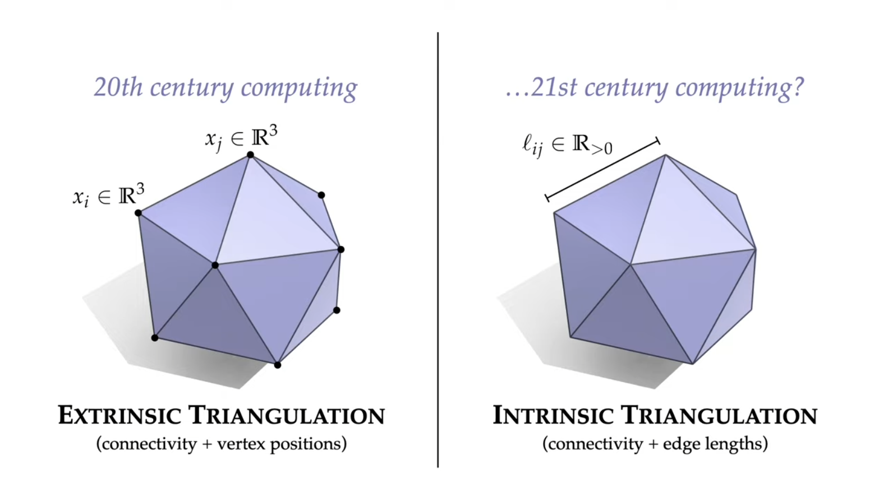
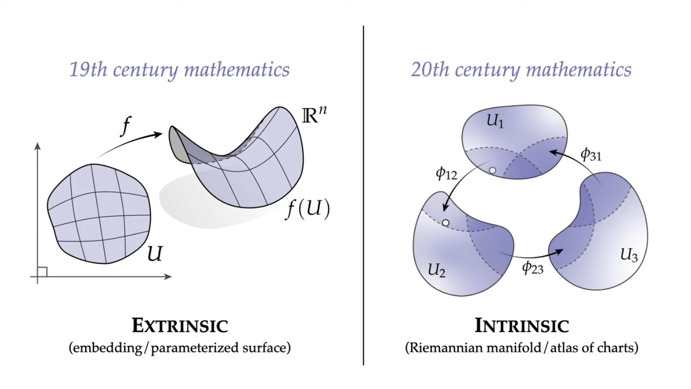
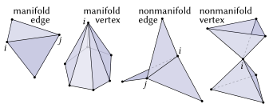
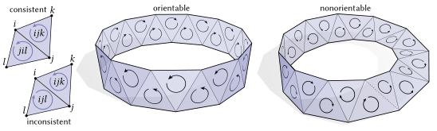
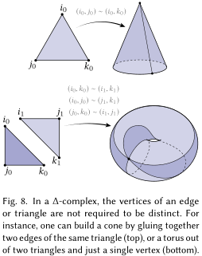
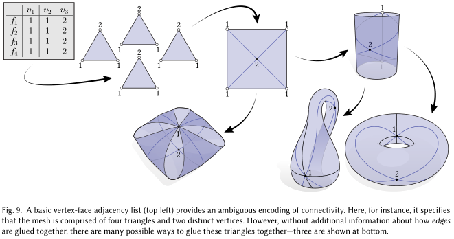


## 概要

離散微分幾何学者 [Keenan Crane](https://www.cs.cmu.edu/~kmcrane/) 先生のメッシュ **内在表現** 関連論文を読んだまとめ。

3D モデルの（位相的）三角形分割 $T$ を、メッシュの頂点、エッジ、フェースの組 $(V,E,F)$ で表記する。各頂点をインデックス $i\in V$ で表し、エッジとフェースはそれぞれ $ij\in E, ijk\in F$ などと表すことにする。通常、メッシュのデータ表現は、おもに頂点座標 $\mathbf{f}: V \rightarrow \mathbb{R}^{3}$ と頂点間の接続を表すリストを用いる（e.g. Halfedge, Signed incidence matrices, Gluing map）。以下この表現を **外在表現** と呼ぶ。

**内在表現** は、エッジ長 $\ell: E \rightarrow \mathbb{R}\_{>0}$ と接続関係を用いる。ただし任意の $ijk\in F$ について $\ell$ の像は三角不等式をつねに満たす、つまり 2 次元的に展開可能であるものとする。$\ell_{ij}$ は外在表現によって定まるメッシュの $i,j$ 間の測地線長である。

メッシュの外在／内在表現は、連続的な曲面の埋め込み写像による表現と多様体としての表現の対比になぞらえられる。

内在表現は剛体変換などに関する自由度があり、また本来のジオメトリももはや明らかではないが、ジオメトリを保持したままメッシュを最適化できる特性がある。また外在表現における既知のアルゴリズムの多くがそのまま適用できる。

## 読んだやつ
1. Nicholas Sharp, Yousuf Soliman, & Keenan Crane (2019). [Navigating Intrinsic Triangulations](https://www.cs.cmu.edu/~kmcrane/Projects/NavigatingIntrinsicTriangulations/index.html). ACM Trans. Graph., 38(4). (SIGGRAPH 2019 / ACM Transactions on Graphics 2019)
2. Sharp, N., Gillespie, M., & Crane, K. (2021). [Geometry Processing with Intrinsic Triangulations](https://markjgillespie.com/Research/int-tri-course/int_tri_course.pdf).
3. Liu, H.T., Zhang, J., Ben-Chen, M., & Jacobson, A. (2021). [Surface Multigrid via Intrinsic Prolongation](https://www.dgp.toronto.edu/projects/intrinsic-prolongation/). ACM Trans. Graph., 40(4).
4. Nicholas Sharp, & Keenan Crane (2020). [A Laplacian for Nonmanifold Triangle Meshes](https://www.cs.cmu.edu/~kmcrane/Projects/NonmanifoldLaplace/index.html). Computer Graphics Forum (SGP), 39(5).
5. Gillespie, M., Sharp, N., & Crane, K. (2021). [Integer Coordinates for Intrinsic Geometry Processing](https://arxiv.org/abs/2106.00220). ACM Trans. Graph., 40(6).
6. Sharp, N., & Crane, K. (2020). [You Can Find Geodesic Paths in Triangle Meshes by Just Flipping Edges](https://nmwsharp.com/research/flip-geodesics/). ACM Trans. Graph., 39(6).
7. Allen Hatcher. 2002. [Algebraic Topology](https://pi.math.cornell.edu/~hatcher/AT/ATpage.html).
8. J. Cao, A. Tagliasacchi, M. Olson, H. Zhang and Z. Su, "[Point Cloud Skeletons via Laplacian Based Contraction](https://ieeexplore.ieee.org/document/5521461)," 2010 Shape Modeling International Conference, 2010, pp. 187-197, doi: 10.1109/SMI.2010.25.

### ライブラリ
- [Geometry Central](http://geometry-central.net/) (C++)
- [Geometry Processing with Intrinsic Triangulations](https://github.com/nmwsharp/intrinsic-triangulations-tutorial) (python)
  - SIGGRAPH 2021, IMR 2021 tutorial

## Connectivity
三角形分割 $T=(V,E,F)$ が以下を満たすとき、$T$ を **manifold** と呼ぶ（数学の『多様体』と紛らわしいが、とりあえずこう表記する）：
- 任意のエッジ $ij \in E$ を含むフェースは $1$ 個か $2$ 個
  - ほかのフェースに含まれないエッジをもつフェースを境界 $\partial E$ と呼ぶ
- 任意の頂点 $i\in V$ を含むフェース全体がエッジ連結している

$T$ の任意のエッジの向きが consistent のとき（*i.e.* halfedge で整合的に表現できる）、$T$ は **向きづけ可能** という。

以下しばらく、メッシュは manifold かつ向きづけ可能と仮定する。後ほど non-manifold なメッシュや向きづけ不可能なメッシュ、点群に対して、いくつかの手法が拡張できることを見る。

## Δ-複体
**Δ-複体** は単体複体を拡張した概念で、各要素は重複した頂点をもつことができる。定義は [資料](#読んだやつ) 7. Section 2.1 など。

Δ-複体の頂点の次数を、接続するエッジ数で定義する。頂点に接続するエッジの集合を走査し、エッジの両端点が異なるときはそれぞれに $+1$、同じときは $+2$ する。展開図上では単一のエッジが複数回描かれる可能性があることに注意する。

隣接行列でΔ-複体を表現すると、トポロジーはもはや一意に定まらない。そのほか、単体複体のときは直感的には自明であったいくつかの性質が、Δ-複体において非自明となることがある。

## Intrinsic Geometry, Edge Flip

(Under construction)