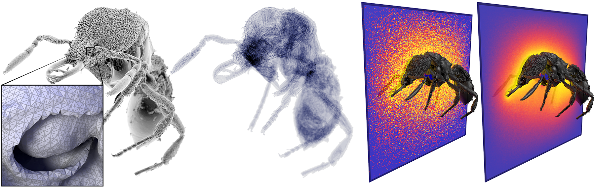
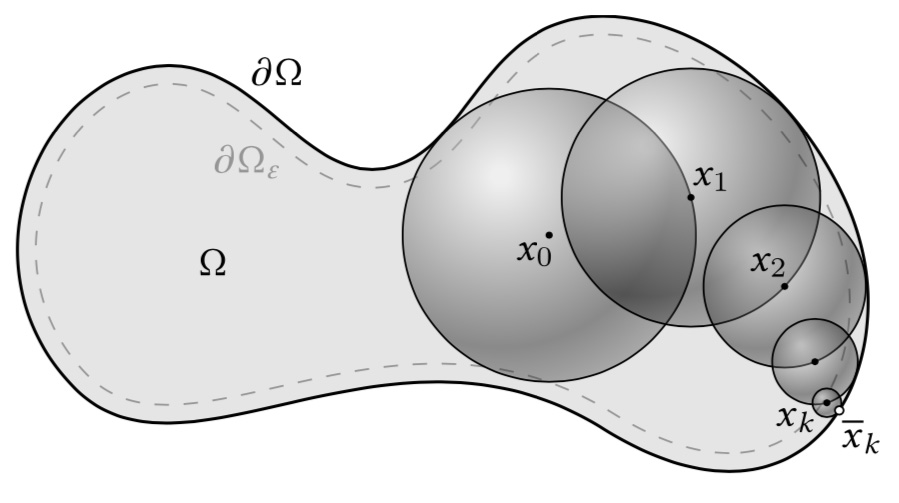
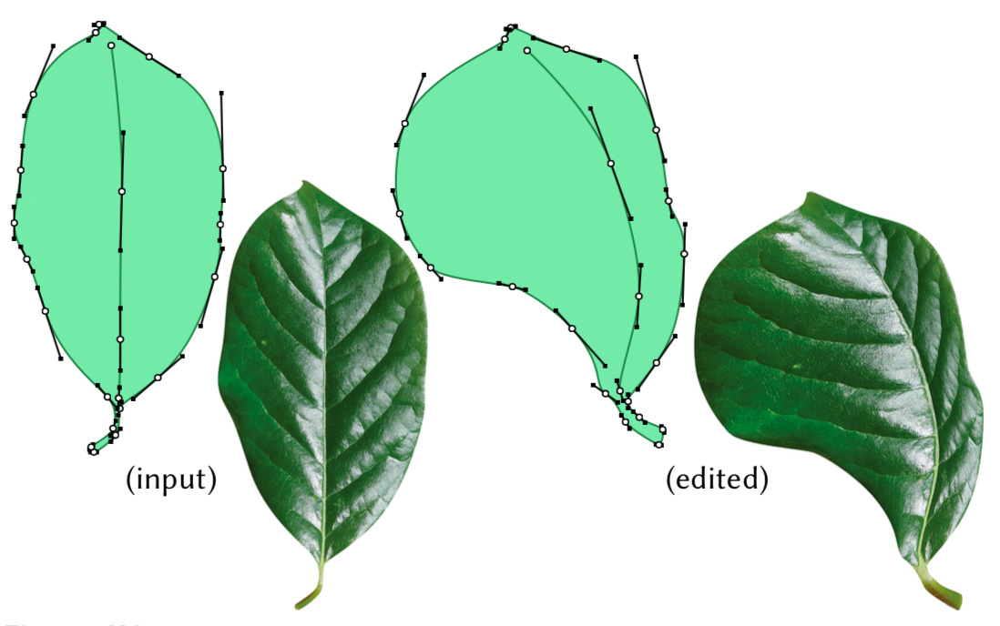

## 資料
1. Sawhney, R., & Crane, K. (2020). [Monte Carlo Geometry Processing: A Grid-Free Approach to PDE-Based Methods on Volumetric Domains](https://www.cs.cmu.edu/~kmcrane/Projects/MonteCarloGeometryProcessing/index.html). ACM Trans. Graph., 39(4).
2. Sawhney, R., Seyb, D., Jarosz, W., & Crane, K. (2022). [Grid-free Monte Carlo for PDEs with spatially varying coefficients](https://cs.dartmouth.edu/wjarosz/publications/sawhneyseyb22gridfree.html). ACM Transactions on Graphics (Proceedings of SIGGRAPH), 41(4).
3. Jacobson, A., Baran, I., Popović, J., & Sorkine, O. (2011). [Bounded Biharmonic Weights for Real-Time Deformation](https://homes.cs.washington.edu/~jovan/papers/jacobson-2011-bbw.pdf). ACM Trans. Graph., 30(4).
4. Oded Stein, Eitan Grinspun, Max Wardetzky, & Alec Jacobson (2017). [Natural Boundary Conditions for Smoothing in Geometry Processing](https://arxiv.org/abs/1707.04348). CoRR, abs/1707.04348.

## 概要
（単純）モンテカルロ法は、積分 $\displaystyle I:=\int_{\Omega} f(x) d x$ を $N$ 個のサンプルから以下のように近似する。
$$
F_{N}:=|\Omega| \frac{1}{N} \sum_{i=1}^{N} f(X_{i}), \quad X_{i} \sim \mathcal{U}(\Omega)
$$
ここで $\mathcal{U}(\Omega)$ は領域 $\Omega$ 上の一様分布を表す。より一般に $\Omega$ 上の任意の確率分布 $p$ に対して以下が成り立つ。
$$
\frac{1}{N} \sum_{i=1}^{N} \frac{f(X_{i})}{p(X_{i})}, \quad X_{i} \sim p
$$
本手法は調和関数の積分に関する式から出発して、volumetric な 3D モデル上のいくつかの実用的な偏微分方程式をモンテカルロ法に基づいて解く、WoS (Walk on Spheres) アルゴリズムを研究する。このアプローチには例えば以下の利点が考えられる。
- **幾何学的柔軟性**：メッシュ、NURBS、陰関数表現などの 3D モデルを直接扱うことができる
- **幾何学的頑健性**：water-tight でないメッシュや、manifold でなかったり orientable でないメッシュに対しても適用できる
  - （精度はメッシュの品質劣化にともなって悪くなる）
- **精度**：3D モデルや時間の離散化をともなわないため、誤差はモンテカルロ法にともなう分散によってのみ推定される

滑らかな境界をもつ単純な形状や解が高周波成分をもつようなケースでは、既存の FEM と比較して性能が劣ることもある。

WoS アルゴリズムでは干渉判定が頻出する。したがって対象とする 3D モデルに対しては、レイトレーシングで広く利用されている BVH (Bounding Volume Hierarchy) と呼ばれる階層的なデータ構造を事前に構成しておく。レイトレーシングの文脈においては、交差判定や物理シミュレーションの衝突判定の高速化に利用される。

- [BVHのはなし](https://shinjiogaki.github.io/bvh/)

もともと 3D CG レンダリングが 3D モデルのメッシュ化を捨象してレイトレーシングに必要なデータ構造だけでやっていくことで計算資源を大幅に削減することに成功しており、このアイデアの適用範囲を広げたいというのが動機としてあったようである。



BVH 構築は FEM のリメッシュと比べれば短時間でできる（資料 1. Fig.25.）。

## WoS アルゴリズム

以下のラプラス方程式から出発する：
$$
\begin{align\*}
\Delta u&=0 & \text { on } \Omega, \\\\\\
u&=g & \text { on } \partial \Omega.
\end{align\*} 
$$

解（調和関数）$u$ については、以下の性質が知られている。
- **角谷の原理**：$u(x)$ は $x$ を始点とするランダムウォークが $y\in\partial \Omega$ で初めて境界と接触するときの $g(y)$ の期待値に等しい
- **平均値の性質**：任意の $x\in\Omega$ の近傍球 $B(x)\subset\Omega$ について以下が成り立つ：
$$
u(x)=\frac{1}{|\partial B(x)|} \int_{\partial B(x)} u(y) d y
$$

WoS アルゴリズムはこれらの性質に基づく。 $u(x_0)$ は $\displaystyle\frac{1}{N} \sum_{i=1}^{N} \hat u_0(x_{0})$ によって近似される。ここで $\hat{u}$ は以下の漸化式から導出される：
$$
\hat u_0(x_k):=\left\\{
\begin{align\*}
  &g(\bar x_k), & x_k \in \partial \Omega_{\epsilon} \\\\\\
  &\hat u_0 (x_{k+1}), & \text{otherwise}
\end{align\*} 
\right.
$$

ただし $x_{k+1}$ は球 $B(x_k)$ を $\Omega$ に含まれる範囲で大きくとったときの境界 $\partial B(x_k)$ からランダムに選択する。また $\partial\Omega_{\epsilon}$ は境界 $\partial\Omega$ からトレランス $\epsilon$ 内の領域であり、$\bar{x}_{k}$ は $x_k$ からもっとも近い $\partial\Omega$ 上の点を表すものとする。

<!--  -->


なお $\partial\Omega_{\epsilon}$ に到達するまでの必要ステップは $O(\log 1/\epsilon)$ とのこと。

### ポアソン方程式

ポアソン方程式はラプラス方程式の一般化であり、応用としては 3D サーフェス再構成にしばしば登場する。
$$
\begin{align\*}
\Delta u&=f & \text { on } \Omega, \\\\\\
u&=g & \text { on } \partial \Omega.
\end{align\*} 
$$

ポアソン方程式に対しては、平均値に関する性質が以下のように一般化できる。
$$
u(x)=\frac{1}{|\partial B(x)|} \int_{\partial B(x)} u(y) d y+\int_{B(x)} f(y) G(x, y) d y
$$
ただし $G(x,y)$ は調和グリーン関数（資料 1. Appendix 参照）。これより以下のように WoS アルゴリズムが導出される。

$$
\hat u_f(x_k):=\left\\{
\begin{align\*}
  &g(\bar x_k), & x_k \in \partial \Omega_{\epsilon} \\\\\\
  &\hat u_f(x_{k+1})+|B(x_{k})| f(y_{k}) G(x_{k}, y_{k}), & \text {otherwise}
\end{align\*}
\right.
$$

ただし $y_k\sim\mathcal{U}(B(x_k))$ とした。

### 投影ポアソン方程式
投影ポアソン方程式は定数 $c>0$ を用いて以下のように表される。
$$
\begin{align\*}
\Delta u-c u&=f & \text { on } \Omega \\\\\\
u&=g & \text { on } \partial \Omega
\end{align\*}
$$
この方程式もサーフェス再構成に用いられ、ある曲面に投影したようなサーフェスが出力される（cf. [Meshlab 3D processing: Screened Poisson Reconstruction](https://youtu.be/fZI925P1aXw)）。またサーフェスのフィルタリングや測地線距離の計算にも用いられるとのこと。

前節の調和グリーン関数 $G$ を湯川ポテンシャルと呼ばれる関数 $G_c$ に置き換えれば、平均値に関する性質と WoS アルゴリズムに関する表式は、ポアソン方程式のときとまったく同じになる（資料 1. Appendix 参照）。

### 重調和方程式
以下の重調和方程式は、ジオメトリの連続変形や形状間の対応づけなどの応用が存在するとのこと。
$$
\begin{align\*}
\Delta^{2} u&=0 & \text { on } \Omega \\\\\\
u&=g & \text { on } \partial \Omega \\\\\\
\Delta u&=h & \text { on } \partial \Omega
\end{align\*} 
$$

この方程式は 2 つの 2 階偏微分方程式に分解できる：
$$
\begin{align\*}
\Delta u&=v & \text { on } \Omega, & & \Delta v&=0 & \text { on } \Omega \\\\\\
u&=g & \text { on } \partial \Omega, & & v&=h & \text { on } \partial \Omega
\end{align\*} 
$$

したがってナイーブに考えれば、既存の WoS の単純な組み合わせでも近似解を求められるが、この実装は計算コストが高くなる。重調和方程式を解くための工夫はのちほど触れる。

### 勾配
調和関数 $u$ の勾配 $\nabla u(x)$ について以下が成り立つ。
$$
\nabla u(x)=\frac{1}{|B(x)|} \int_{\partial B(x)} u(y) v(y) d y
$$

ここで $v(y)$ は球 $\partial B(x)$ 上の外向き単位法線ベクトル。したがって、以下の WoS アルゴリズムで $\nabla u(x)$ を近似できる。
$$
\widehat {\nabla u_0}(x_k):=\frac{n}{R} \hat u_{0}(x_{k+1}) v(x_{k+1}), \quad x_{k+1} \sim \mathcal{U}(\partial B(x_k))
$$
ただし $R$ は球 $B(x_k)$ の半径。

ポアソン方程式の解 $u$ についても同様に、以下の平均値に関する性質が成り立つ。
$$
\frac{1}{|B(x)|} \int_{\partial B(x)} u(y) v(y) d y+\int_{B(x)} f(y) \nabla G(x, y) d y
$$
$G$ は調和グリーン関数。投影ポアソン方程式については、これを湯川ポテンシャル $G_c$ に置換すれば同様の式が成り立つ。

## 誤差の低減
以下、制御変数の導入およびサンプリングにおける工夫によって誤差を評価する分散を低減する戦略を示す。

### 制御変数
$\Omega$ 上の関数 $\phi$ が $x_0\in\Omega$ 近傍において既知の関数 $\tilde{\phi}$ で近似され、$\tilde{\phi}$ の $x_0$ 近傍上の積分は $c\in\mathbb{R}$ となるとする。このとき、
$$
c+\frac{1}{N} \sum_{i=1}^{N} \{\phi(X_{i})-\tilde{\phi}(X_{i})\}
$$
を考えると、これは $x_0$ 近傍上の $\phi$ の積分の近似解と一致し、かつ $x_0$ 近傍において $\phi$ より分散が小さくなることが期待される。これが制御変数の基本的なアイデアになる。

偏微分方程式の解を $u$ とする。$\nabla u(x_{0})\cdot(x-x_{0})$ は $x_0$ の近傍球 $B(x_0)$ 上の $u(x)$ の一次近似であり、$B(x_0),\partial B(x_0)$ 上の積分は $0$ となる（$c=0$）。

そこで、$\overline{\nabla u}^k(x_0)$ を $k$ 回目試行時点の $x_0$ における $u$ の勾配の近似解とする。$u(x_0)$ の近似式 $\displaystyle\frac{1}{N} \sum_{i=1}^{N} \hat u_0(x_0)$ を以下で置換する。
$$
\frac{1}{N} \sum_{i=1}^{N} \hat{u}(x_{0})-\overline{\nabla u}^{i-1}(x_{0}) \cdot(x_{1}^{i}-x_{0}), \quad x_{1}^{i} \sim \mathcal{U}(B(x_{0}))
$$
ただし $x^i_1$ で $i$ 回目試行における $x_1$ を表した。

$u=u_0$ のときは、同様に $\overline{u_0}^k(x_0)$ を $k$ 回目試行時点の $u_0(x_0)$ の近似解として、$\nabla u_0(x_0)$ の近似式 $\displaystyle\frac{n}{R} \frac{1}{N} \sum_{i=1}^{N}\hat u_0(x_0)v(x_1^i)$ に以下のように制御変数を導入する。
$$
\frac{n}{R} \frac{1}{N} \sum_{i=1}^{N}(\hat u_0(x_0)-\bar u_0^{i-1}(x_0)) v(x_1^i)
$$
法線ベクトルの対称性より、制御変数の $\partial B(x_0)$ 上の積分は $0$ となる。

以上のように $u$ および $\nabla u$ の近似に相補的に制御変数を導入することによって、誤差を抑制することができる（資料 1. Fig.6.）。とくに調和関数のヘッシアンのように、高階の微分方程式の解を近似するときに効果を発揮している。

なお類似の手法は強化学習にも用いられているとのこと。

### 適応的サンプリング
これまで WoS アルゴリズムは一様分布からサンプリングしていたが、CG レンダリングのアナロジーとして捉えることで、より分散を低減するような確率分布を用いる戦略を考えることができる。

以下、ポアソン方程式に関する漸化式の項 $|B(x_{k})| f(y_{k}) G(x_{k}, y_{k})$ について考える。従来は $y_k\sim\mathcal{U}(B(x_k))$ であった。

レンダリングにおける双方向反射率分布関数（bidirectional reflectance distribution function; BRDF）から類推すると、代えて $\displaystyle p_{G}:=G \left/ \int_{B(x)} G(x, y) d y\right.$ からサンプリングすると分散が低減するとのこと。

また source term $f$ に注目する。たとえば $f$ の台が $A\subset\Omega$ のとき、$y$ を $A_B:=A\cap B(x)$ から一様サンプリングして、近似式の対応する項を以下で置換する戦略を取ることができる。
$$
|A_{B}| \frac{1}{M} \sum_{j=1}^{M} c(y_{j}) G(x, y_{j})
$$
ただし $c$ は $A$ 上の適当な関数とする。$A$ が一点集合のときは、レンダリングの文脈では光源が一点のみの場合に相当する。

以上の戦略は、複合重要度サンプリングと呼ばれる手法によって統合的に扱われる。

### Tree Walk
重調和方程式の解をモンテカルロ法で求めるアルゴリズムをナイーブに実装すると効率が悪かった。具体的には各モンテカルロのサンプル数 $N$ と平均ステップ数 $S$ に対して、全体で $O(SN^2)$ 回のステップ数を要する。

双方向パストレーシング (Bidirectional Path Tracing) から連想される戦略を適用すると、ステップ数を $O(SN)$ に削減できる。この戦略を Tree Walk という。
- [双方向パストレーシング](https://rayspace.xyz/CG/contents/BPT/) (Bidirectional Path Tracing)

## アプリケーション
### 形状変換
<!--  -->


境界がベジエ曲線で表現される 2 つの領域 $\Omega,\Omega'\in\mathbb{R}^2$ を考える。入力 $\Omega$ によって $\Omega'$ が得られたとみなし、座標変換 $\phi':\Omega'\rightarrow\Omega$ を考える。両者の制御点の個数と接続関係は共通しており、各制御点の座標と重みが異なるとする。

$\Omega$ に貼られているテクスチャが $\Omega'$ 上で自然に写るように $\phi'$ を設計したい。

まず $\phi:=\phi'\mid_{\partial\Omega'}$ の像は $\partial\Omega$ であって、ベジエ曲線のパラメータから直接したがう。

$x\in\partial\Omega$ における法線方向の単位ベクトルを $e_1,$ 接単位ベクトルを $e_2$ とおく。境界周辺では写像を「なるべく線形らしく」したい。そこで $\displaystyle\frac{\partial^{2} \phi'}{\partial e_{1}^{2}}=0$ を要請する。

なお資料 1. には $\Omega$ 内部についての条件の導出は載っておらず、重調和方程式を解く理由はわからない。詳細は資料 3., 4. を読む必要がある。これらによると、ラプラシアン／ヘッシアンの 2 乗の $\Omega$ 上積分で定義されるエネルギーの最小化問題を解く過程で重調和方程式が現れるようである。

上記の設定を WoS で解くことは、メッシュ化をともなう FEM に比べると、重みの変化に伴う直線方向の伸縮を直接扱うため、制御が容易になるという利点がある。

いっぽう WoS による変形の直接計算にかかる時間は、最新の FEM に比べると格段に遅いとのこと。したがって、基底変換の事前計算や再利用などの工夫を検討する必要がある。