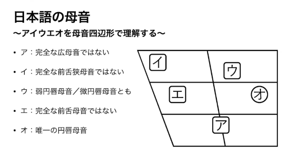

## 前置き
将棋の動画を収録する前から，英語の発音を矯正したいとは思っていた．最近引っ越した結果，近所で海外の旅行客を助ける機会が増えて，想像以上にいまの自分がダメなことに危機感を覚えたのもある．発音への自信のなさは，会話への消極性にもつながる．

私と似たような人も多いと思うが，英語の発音についてこれまで見たことのある記述は，たとえば次のようなものだった：
- `[æ]` は「ア」と「エ」を同時に発音する感じ
- `[ʊ]` は唇を突き出しながら短く「ウ」
- `[l]` は赤ちゃんの舌足らずな音，`[r]` は狼の唸り声

分かるような分からないような……こんな曖昧な説明を一つずつ覚えないといけないのか，しかも英語はフォニックスがかなり不規則のに……とげんなりしてしまい，発音の重要性を理解しながら学習のモチベーションが上がらなかった．

きっかけになったのは，以下の参考資料にも挙げている『母音を理屈で理解する』という動画だった．さらに元を辿れば，初めはこのチャンネルのアラビア語紹介動画がなぜかサジェストされ，それが面白かったのでほかも掘った結果見つけたものだ．

初めて IPA チャートと口腔断面図の対応を知ったときは衝撃だった．こんなに分かりやすく役に立つ理論が，なぜ認知されていないのだろう．これだけで英語への恐怖が薄れる日本人は相当いるんじゃなかろうか．小学生のときに学びたかった．

というわけで，遅ればせながら発音記号と実際の発音を勉強していきたい．

## 参考資料
随時追加．
- [言語の部屋](https://www.youtube.com/@Gengo_No_Heya/featured) (Youtube)
  - [母音を理屈で理解する【音声学入門講座】](https://youtu.be/7905IhIa1oY?si=DJkZkHMeAzBAwdz7)
  - [子音を理屈で理解する【音声学入門講座】](https://youtu.be/1Bv1uMKqG7E?si=xvaIs7TYJs9-Chri)
  - [Wをめぐる綴りと発音の歴史【warpはワープではなくウォープ】](https://youtu.be/abceONi0kp4?si=-Fgkwg7hQNRVmaT9)
- [川原繁人の音声学入門（基礎編）](https://www.youtube.com/playlist?list=PLdrzcCNXDQp3a9qIryGOIJjqXy3OhRXWa)
  - [MRIで英語の母音を確認しよう](https://youtu.be/XDnBPvMO2Q4?si=D1W4InF0Lh1LRBLs)
  - [MRIで学ぶ調音点・調音法（例はすべて英語の発音だよ）](https://youtu.be/Av_-44zImMI?si=AzkrLPr2vAEoV7-O)
- [The International Phonetic Alphabet (IPA)](https://www.cambridge.org/features/IPAchart/) (Cambridge)
- [Help:IPA/English](https://en.wikipedia.org/wiki/Help:IPA/English) (Wikipedia)
- [英語の発音記号45個を徹底解説！【イラスト＆音声つき】](https://eikaiwa.dmm.com/blog/learning-english/tips/phonetic-alphabets/)
- [the rtMRI IPA chart (John Esling)](https://sail.usc.edu/span/rtmri_ipa/je_2015.html)

## 母音
母音は舌や唇によって空気の流れを邪魔せず，声帯の振動によって出す．英語・日本語の母音は，口蓋帆を上げ鼻孔をふさいで発音する（フランス語などには鼻に抜ける鼻母音もある）．

IPA チャート上の母音の判別基準は以下の 3 つ．
1. 円唇母音／非円唇母音
2. 前舌母音／後舌母音
3. 広母音／狭母音

このほか緊張，長短で弁別されることもある．

> 
> （国際音声記号 2020 改訂版）

母音の IPA (International Phonetic Alphabet) チャートの 2 軸は，上記の 2., 3. に対応する．口蓋につける位置が同じ場合，非円唇母音を左側，円唇母音を右側に表記する．

英語で使用する母音に限ったものは [*The International Phonetic Alphabet (IPA)*](https://www.cambridge.org/features/IPAchart/) から見られる．`[a]`, `[ʌ]` など位置が微妙に異なるが，誤植ではなく，英語など各言語の音声記号と国際音声記号が必ずしも一致しないことによる．

下図のように，母音四辺形は断面図上のボトルネックに大まかに対応する．チャート上の距離は口腔内の実際の距離とは関係なく，聴覚上の印象に基づく．

> 
> [母音](https://ja.wikipedia.org/wiki/%E6%AF%8D%E9%9F%B3) (Wikipedia)

> 
> [Vowel](https://en.wikipedia.org/wiki/Vowel) (Wikipedia)

### 日本語の母音
> 
> [母音を理屈で理解する【音声学入門講座】](https://youtu.be/7905IhIa1oY?si=DJkZkHMeAzBAwdz7) (Youtube)

## 子音
子音の判別基準は以下の 3 つ．
1. 調音位置
2. 調音方法
3. 有声性（声帯を使用するかどうか）

### 調音位置
調音器官は能動調音器官と受動調音器官の 2 つに分けられる．
- 能動：唇，舌頂，舌面
- 受動：歯，歯茎，硬口蓋，軟口蓋

これらの組み合わせによって子音を分類する．
- **両唇音**
  - `[m]`, `[p]`, `[b]`, `[w]`
  - `[ɸ]`（日本語の「ファ」）
- **唇歯音**
  - `[f]`, `[v]`
- **歯音**
  - `[θ]`, `[ð]` (e.g. "thing", "this")
- **歯茎音**
  - `[n]`, `[t]`, `[d]`, `[s]`, `[z]`, `[l]`
  - `[ɾ]`（日本語の「ラ」．英語では使わない音とする資料もあるが，Cambridge の表には存在して，"pretty", "patio" などが例に挙げられている）
- **後部歯茎音**
  - `[ʃ]`, `[ʒ]`, `[tʃ]`, `[dʒ]`, `[ɹ]`
- **硬口蓋音**
  - `[j]` (e.g. "yes")
  - `[ç]`（日本語の「ヒャ」．英語では "huge", "human" など一部の単語でしか使わない）
- **軟口蓋音**
  - `[ŋ]`, `[k]`, `[g]`
- **声門音**
  - `[h]`

### 調音方法

#### 鼻音／破裂音
発音時に口腔の閉鎖をともなう子音の分類．
- **鼻音**：口蓋帆は下がっており，鼻孔に空気が抜ける（鼻をつまむと発音できない）
  - `[m]`, `[n]`, `[ŋ]`
- **破裂音**：口蓋帆が上がる（閉鎖 ⇒ 持続 ⇒ 解放）
  - `[p]`, `[b]`, `[t]`, `[d]`, `[k]`, `[g]`

#### 摩擦音／接近音
発音時の隙間の大小による分類．広母音／狭母音に似ている．
- **摩擦音**：隙間小
  - `[f]`, `[v]`, `[θ]`, `[ð]`, `[s]`, `[z]`, `[h]`
- **接近音**：隙間大
  - `[w]`, `[j]`, `[ɹ]`, `[l]`
    - `[w]` は日本語の「ワ」のように両唇のみで発音するのではなく，軟口蓋も接近させて発音する．二重調音と呼ばれる
    - `[l]` は舌先と歯茎を接触させるが，舌の両側は空けて発音する．側面接近音と呼ばれる
  - 母音に近い性質のため，半母音とも呼ばれる 

#### 破擦音，はじき音，ふるえ音
- **破擦音**：破裂音＋摩擦音．破裂音の解放を制限する
  - `[tʃ]`, `[dʒ]`（後部歯茎音）
  - （歯茎音として `[ts]`, `[dz]` を含めた表もあるが，Cambridge の表では空欄になっている．上記の後部歯茎音と区別しなくても差し支えはないと思う）
- **はじき音**：瞬間的に閉鎖を一回つくる
  - `[ɾ]`
- **ふるえ音**：瞬間的な閉鎖を断続させる
  - `[r]`（イタリア語，スペイン語など）, `[ʀ]`（ドイツ語など）
  - 英語にはない

### 有声性
声帯が振動する子音を有声音という．

- 鼻音，接近音，はじき音，ふるえ音は常に有声
- 破裂音，摩擦音は有声音と無声音がある
  - e.g. `[p]`/`[b]`, `[s]`/`[z]`

言語によっては有声音／無声音ではなく，有気音／無気音を区別する（e.g. 中国語）．

### 一覧
> 
> [母音を理屈で理解する【音声学入門講座】](https://youtu.be/7905IhIa1oY?si=DJkZkHMeAzBAwdz7) (Youtube)

